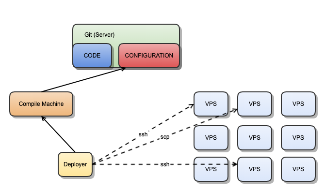

### logical view

* start from codes
    1. download secure_deployer runnable jar and run as web service (Deployer)
    2. add compile machine: manually add generated ids_rsa.pub to compile machine (with commands suggestion)
    3. control compile machine to use a git(Server) deploy key to pull data of a project
    4. control compile machine to compile and package
    5. download packages from compile machine
* all operations and data transfer is secure with ssh and scp
* manage vps cluster(deploy packages and control with ssh)
    1. generate key pair
    2. manually add generated ids_rsa.pub to compile machine (with commands suggestion)
    3. deploy packages to any vps
    4. run services in vps

### feature
1. generate ids_rsa key pair and save
2. interact with compile machine
    * setup
        + manage host
        + manage key pair
    * pull codes/configurations from git and compile/package
3. interact with vps
    * setup
        + manage hosts
        + manage key pair
    * download packages from compile machine
